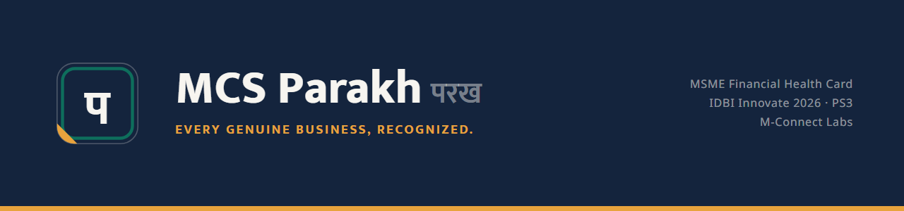
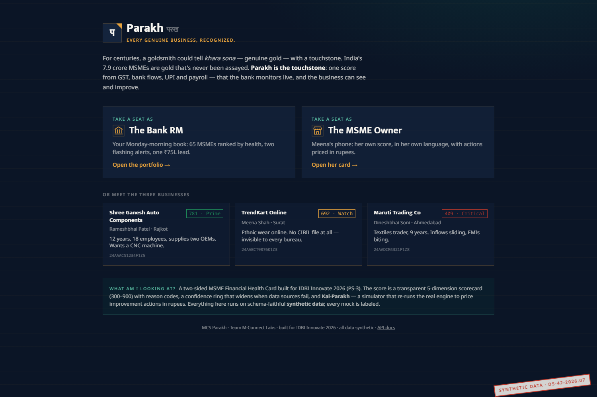
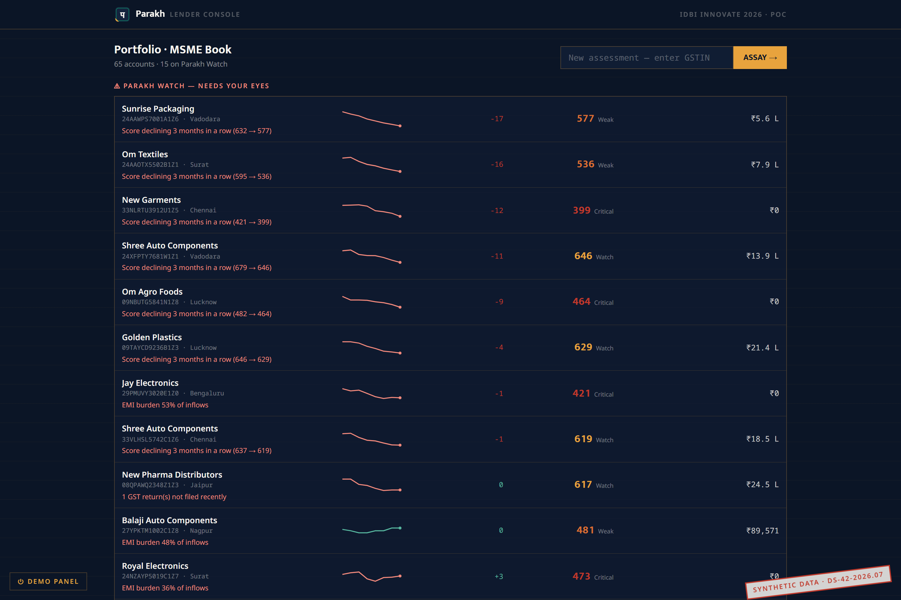
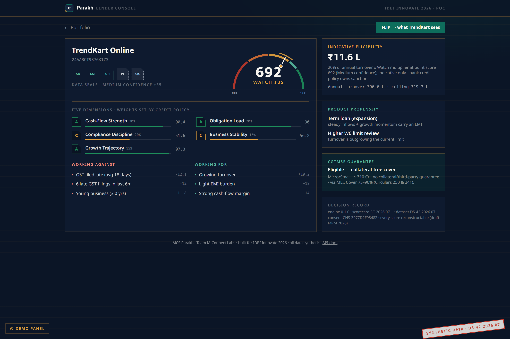
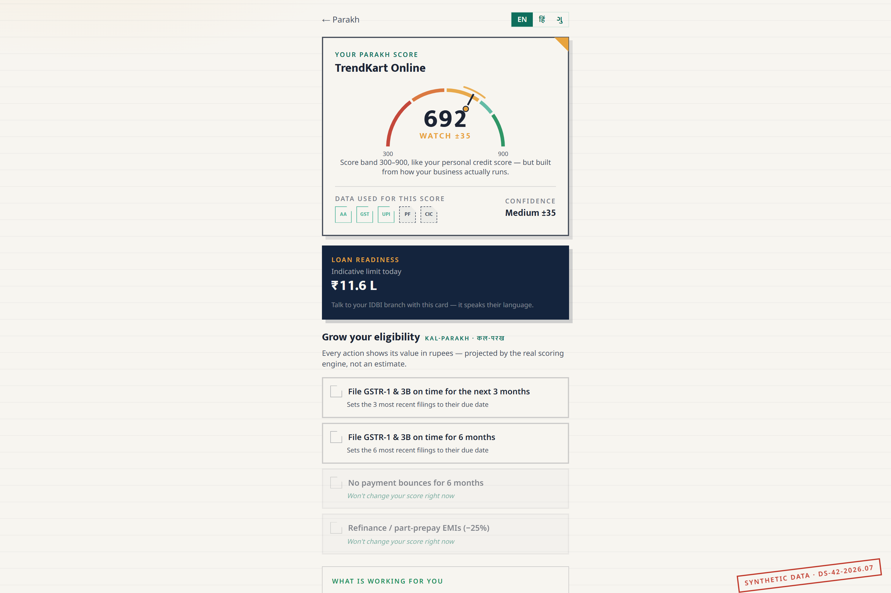

# MCS Parakh (परख) — by M-Connect Labs

[](https://github.com/jitenrajput/mcs-parakh/actions/workflows/ci.yml)
[](LICENSE)


**A two-sided, explainable MSME Financial Health Card. Built for IDBI Innovate 2026 (PS3).**

> *Parakh — har khare vyapar ki pehchaan.* Every genuine business, recognized.

For centuries, a goldsmith could tell genuine gold with a touchstone. India's MSMEs — **~7.9 crore registered on Udyam and Udyam Assist** — are gold that has rarely been assayed: the addressable credit gap stands at **₹30 lakh crore**, and formal supply covers only **~37% of debt demand** (SIDBI × CRISIL, May 2025). Scores exist and data rails exist; what's missing is the **bank-side layer that acts on them**. Parakh is that layer.

**⚠️ PoC honesty note: every data point in this repository is synthetic** (dataset `DS-42-2026.07`, generated by `backend/datagen/`), schema-faithful to public conventions — ReBIT AA `deposit.xsd`, `GSTR1_3B`, EPFO ECR, CMR-style bureau. Every screen carries a synthetic-data watermark. The adapter layer swaps to sandbox/live APIs without touching scoring code.

## What it does

**Lender side** — a portfolio the RM opens on Monday morning:
- **Parakh Score**: 300–900 composite over 5 transparent dimensions — Cash-Flow Strength (30%), Compliance Discipline (20%), Obligation Load (20%), Growth Trajectory (15%), Business Stability (15%) — graded-bin scorecard, no black box. Each weight is shown on the card as **bank-set credit policy**, not a model-learned coefficient — auditable and stable, the way a credit committee needs it.
- **Reason codes** from point contributions; A–E dimension chips; every score contestable.
- **Coverage ring + confidence band**: five source icons around the gauge; a missing source visibly dims and widens the band (±15/±35/±60).
- **Parakh Watch**: rolling monthly score series + transparent early-warning alert rules.
- **CGTMSE eligibility flag** (4-condition logic, circulars cited) and product-propensity rail.
- **Adapter kill-switch** (demo control): kill any data source live — the card degrades gracefully instead of failing.

**MSME side** — the same score, facing the business:
- Plain-words strengths and risks in **English / हिन्दी / ગુજરાતી**.
- **Kal-Parakh** ("tomorrow's assay"): a simulator that re-runs the *actual* scoring engine with hypothetical actions — every action denominated in rupees, not points. *"File GSTR-3B on time for 3 months → your eligible working-capital limit grows."*
- Loan-readiness meter tied to band-based eligibility (indicative — bank credit policy owns final sanction).

**Governance built in**: every score response and audit row carries `engine_version` + `scorecard_version` + `dataset_version`; consent is a first-class object (AA para-6.3 style consent screen, DPDP notice); SQLite audit log per decision — aligned with RBI's draft Model Risk Management guidance (24 Jun 2026) and FREE-AI (Aug 2025) direction.

## Screenshots

| The demo launcher | The RM's Monday morning |
|---|---|
|  |  |

| Lender health card (692 · Watch · Medium ±35) | The same business, MSME side |
|---|---|
|  |  |

## Quick start

**One command (Docker):**

```bash
docker compose up
# → http://localhost:8000        (app)
# → http://localhost:8000/api/docs  (OpenAPI)
```

**Bare (Python 3.11+ and Node 20+):**

```bash
# API
cd backend
pip install -r requirements.txt
uvicorn api.main:app --port 8000 --root-path /api   # --root-path so the /api/docs link resolves behind the Vite proxy

# Frontend (second terminal; dev server proxies /api → :8000)
cd frontend
npm ci
npm run dev
```

The synthetic dataset (65 MSMEs × 24 months) ships in `data/`. Regenerate it deterministically:

```bash
cd backend/datagen && python generate.py   # seed-stamped as DS-42-2026.07 in data/index.json
```

**Tests:**

```bash
cd backend && python -m pytest   # engine (10) + API (6) + demo-canon regression (4)
```

The demo-canon suite pins the exact numbers the demo promises (781 / 692→721 / +₹3.9L / 409, and the kill-a-source degradation staircase) — if a change breaks a demo beat, CI goes red before demo day does.

## Design decisions (deliberate, not missing)

- **No login screen.** This PoC is an open jury demo over 100% synthetic data — there is no real datum to protect, and a QR-scanning juror must be inside the product in five seconds. Role separation is demonstrated by the seat-picker (lender console vs MSME self-view). Production design: Cognito with role-scoped views, OAuth2 client-credentials + mTLS on the API (see architecture).
- **The demo panel (`/admin/killswitch`) is intentionally exposed.** Killing a data source live — and watching the score survive while the confidence band widens and the eligible limit honestly drops — is the core resilience demonstration, offered to the jury interactively.
- **Open CORS, no rate limiting (yet).** Correct for a synthetic-data demo; rate limiting ships with public hosting, and both are one-line changes for production.
- **No LLM anywhere in the scoring path.** Scores, reasons, and simulations are pure deterministic computation — reproducible, auditable, zero hallucination risk, ₹0 per score.

## Architecture

```
        [SourceAdapter protocol]          [parakh_engine]                [FastAPI]            [React]
  AA bank (ReBIT deposit.xsd) ─┐   FeatureExtractor per source     /score  /explain      Demo launcher
  GST GSTR-1/3B filings       ─┤   graded bins → points →          /portfolio            Lender portfolio
  UPI flows (via AA, mode=UPI)─┼─► 5 dimensions → weighted   ───►  /consent  /simulate ► Health Card
  EPFO ECR (employer-consent) ─┤   composite → 300–900             /admin/killswitch     MSME self-view
  Bureau (CMR-style)          ─┘   + reasons + confidence          OpenAPI (ULI-ready)   Kal-Parakh
                                        │
                              consent store + audit log (SQLite, version-stamped rows)
```

**Design principle: adapters, not integrations.** Every source sits behind one `SourceAdapter` interface returning a `FetchResult` with explicit `status` (OK / PARTIAL / PENDING / FAILED / CONSENT_REVOKED) and `coverage`. Partial data is never treated as complete — it narrows into the confidence band instead. PoC uses mock adapters over synthetic data; the prototype phase swaps in sandbox adapters; scoring code never changes. (EPFO is deliberately a separate employer-consented adapter — it is not an Account Aggregator FIP.)

## Repository layout

```
backend/
  datagen/          synthetic data generator (schema-faithful, seed-stamped)
  adapters/         SourceAdapter protocol + 5 mock adapters + registry
  parakh_engine/    feature extraction, scorecard, reasons, confidence, monitoring
  api/              FastAPI app (main.py) + single-container entrypoint (serve.py)
frontend/           React + Vite + Tailwind, custom SVG viz, EN/HI/GU i18n
data/               synthetic dataset DS-42-2026.07 (65 MSMEs × 24 months)
docs/               blueprint: requirements → architecture → UX → score policy
assets/brand/       logo marks
```

## Team — M-Connect Labs

| Member | Role |
|---|---|
| Jitendra Rajput | Leader / Product |
| Jayesh Trivedi | Project Lead |
| Zaid Shaikh | ML / Python |
| Nirmal Prajapati | QA / Testing |

15+ years building and running MSMEs and shipping software for them — this product's first user is its own team.

## License

**Source-available for evaluation only** — not open-source. © 2026 M-Connect Labs.
All rights reserved. The code may be read and evaluated (including by IDBI Innovate
2026 judges and IDBI Bank); no use, reproduction, modification, distribution, or
deployment is permitted. See [LICENSE](LICENSE). Built for IDBI Innovate 2026.

*Stats above: SIDBI "Understanding Indian MSME Sector" (May 2025); PIB Udyam registration data (Feb 2026).*
