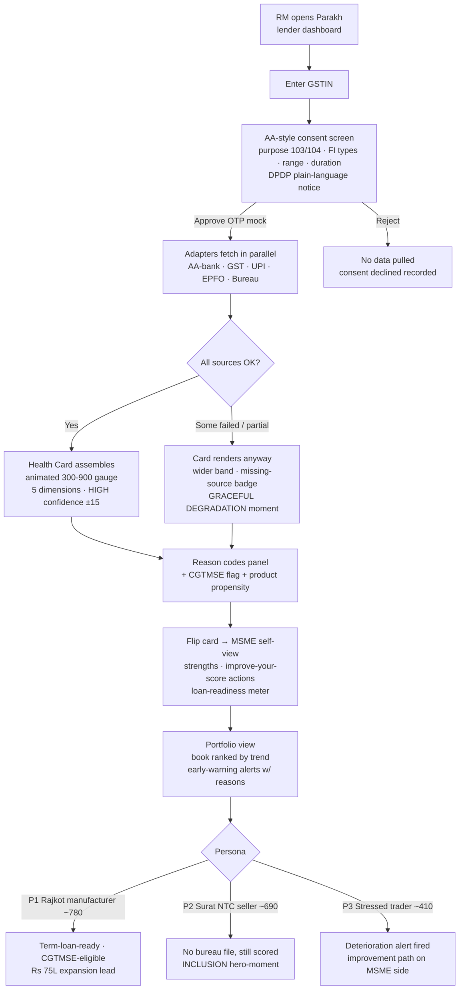
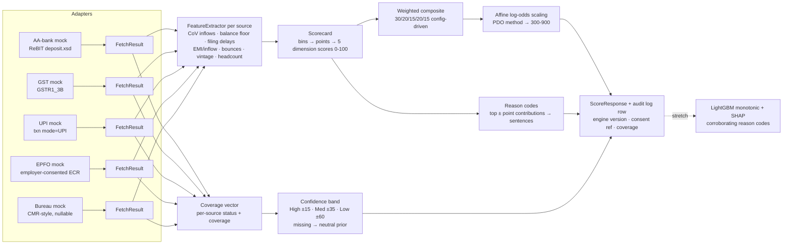
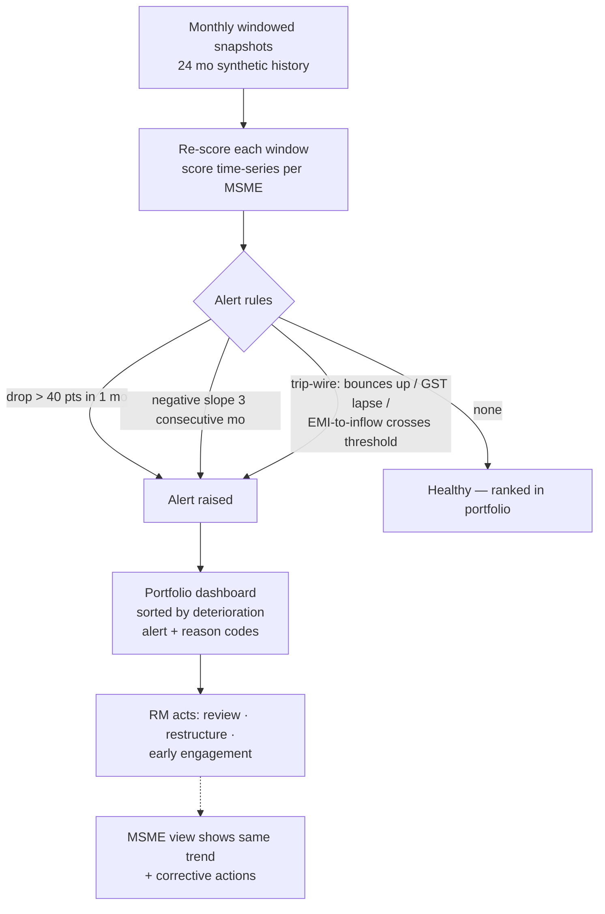
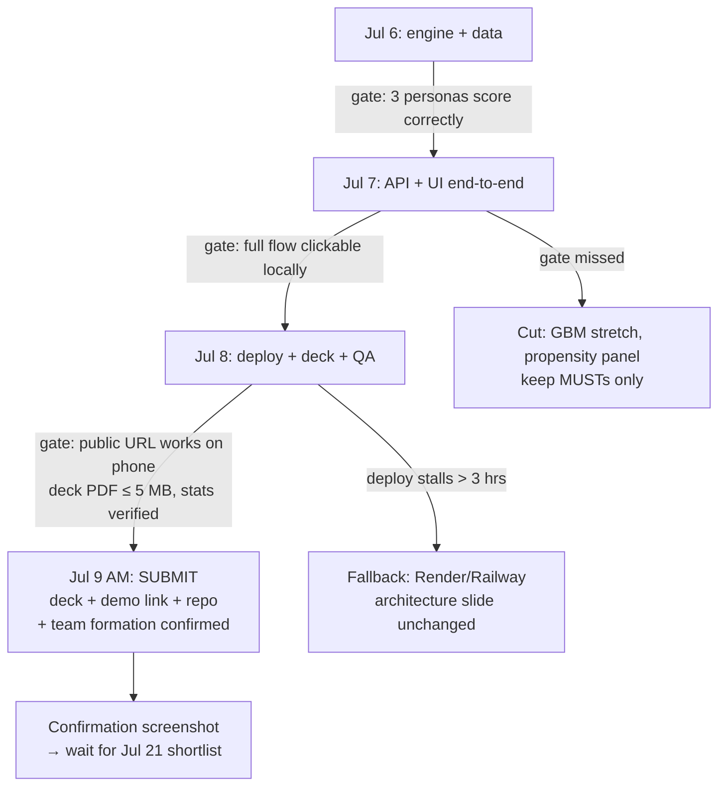

# 03 — Flowcharts

Mermaid — renders directly on GitHub. These four flows ARE the demo script; QA walks them daily.

## 1. Demo user flow (the 3-persona storyline)

## 2. Scoring pipeline (engine internals)

## 3. Early-warning loop (continuous monitoring)

## 4. Submission-week decision flow (process, not product)

